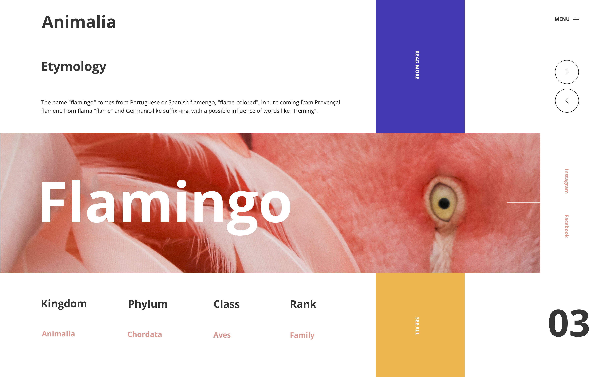

autoscale: true

# *CTFEDs*

# CSS grid layout

---

## https://ctfeds.org/grid-2018/

---

# About me

^ Of me

---

# What we will do

---

## Recap layout techniques

---

## Grid concepts and properties

---

## Image gallery

---

## Build a layout with grid

---

---

# What we won't do in detail but is also important

- Box alignment

---

# The old ways

---

## Formatting context

---

# The new ways

---

# Break (10m)

---

# Grid properties

---

## Enable grid

---

## Columns and rows

---

## Units of measure

---

## Grid examples

---

## Responsive image gallery

---

## Break (10m)

---

# Work on grid

---

# Comment on the workshop

---

# Thanks! :smile:
