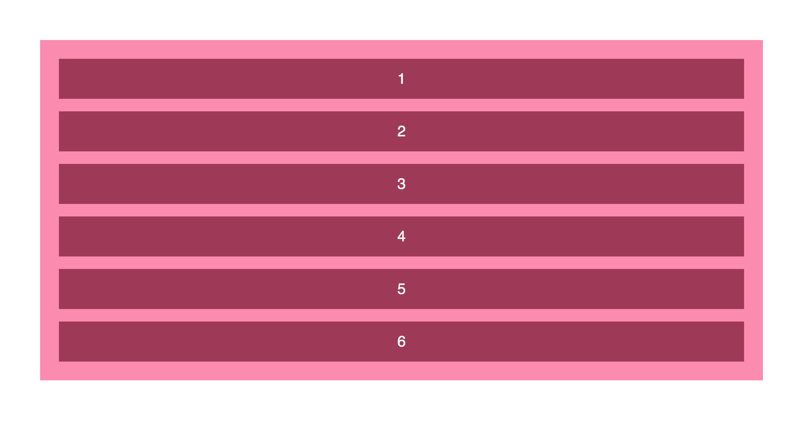

autoscale: true
build-lists: true
theme: Next larger

## What's one thing you know about layout CSS? Write it on a sticky.

### Introduce yourself to someone new, and share your answer

---

# *CTFEDs*

# CSS grid layout


^
Here are some things about grid. There are many other things about grid we won't cover. We will point you to those other things

---

# About us


^ Of us

---

# What we will do

---

## Recap layout techniques

---

## Grid concepts and properties

---

## Simple grid



---

## Complex layout


---

# What we won't do in detail but is also important

- ### Box alignment

- ### Writing modes

- ### Grid template areas

---


^
Two reasons for this. We are constrained by our tools. People have become accustomed to these layouts so we believe they "work".


---

# The old ways

---

# The web is fluid

[The first web page](http://info.cern.ch/hypertext/WWW/TheProject.html)

^
Show first web page from CERN

---

# Layouts in the dark ages (the 90s)

- ### Complex nested tables

- ### inline styles (such as they were)

- ### spacer gifs

- ### Flash


---

## Absolutely no flexibility

---

``` html
<TABLE BGCOLOR="#CCCCFF" BORDER=10 BORDERCOLOR="#0000FF"
BORDERCOLORLIGHT="#33CCFF" BORDERCOLORDARK="#0000CC"
WIDTH="80%" ALIGN="CENTER">
  <TR>
    <TD>
      <H1 align="center">
        <FONT SIZE="3" COLOR="red" FACE="verdana">
          Welcome to my home page!
        </FONT>
      </H1>
    </TD>
  </TR>
</TABLE>
```

---

# Table-less layouts – divs, floats and positioning

- ## separation of presentation and content

- ## floats

- ## absolute and relative positioning

- ## media queries


---

# Simple grid type layout


^
How would you go about doing this assuming no grid/flexbox?
Floats + nth-of-type

---

# Floats


^
As soon as we have different heights we have problems

---

### First...

``` html
.grid4 .col:nth-of-type(4n+1),
.grid3 .col:nth-of-type(3n+1),
.grid2 .col:nth-of-type(2n+1) {
  margin-left: 0;
  clear: left;
}
```

---

### And then...

``` html
@media screen and (max-width: 46.25em) {
  .grid4 .col {
    width: 31.2%;
  }
  .grid4 .col:nth-of-type(4n+1) {
    margin-left: 3.2%;
    clear: none;
  }
  .grid4 .col:nth-of-type(3n+1) {
    margin-left: 0;
    clear: left;
  }
}
```
---

### And also...

``` html
@media screen and (max-width: 37.5em) {
  .grid4 .col {
    width: 48.4%;
  }
  .grid4 .col:nth-of-type(3n+1) {
    margin-left: 3.2%;
    clear: none;
  }
  .grid4 .col:nth-of-type(2n+1) {
    margin-left: 0;
    clear: left;
  }

  .grid3 .col {
    width: 48.4%;
  }
  .grid3 .col:nth-of-type(3n+1) {
    margin-left: 3.2%;
    clear: none;
  }
  .grid3 .col:nth-of-type(2n+1) {
    margin-left: 0;
    clear: left;
  }
}
```

---

### Which leads to...

# :grimacing:

^
frustration

---

### Perhaps even...

# :sob:

^
tears

---

## So we just give up and download...

---


---

### And the inevitable...

# :rage:

^
as you write a CSS declaration with a specificity of 120 to change the colour of a button

---

## Now what if you had a grid that looked like this?

---


^
Complex layouts are very difficult with old methods

---

# The new ways

---

# What about flexbox?

---

# Flexbox

## flexbox was designed for layout in one dimension, i.e. layout in a row *or* a column

^ share similar features e.g. alignment properties

---

# Flexbox - `flex-direction: row`


---

# Flexbox - `flex-direction: column`


---

# Flexbox versus grid

## Grid was designed for two-dimensional layout, i.e. layout in rows and columns at the same time

---

# Grid


^
Grid started life in 2011, via a proposal sent to the CSS Working Group from Microsoft

---

# Grid

## CSS Grid Layout introduces a two dimensional grid system to CSS.

---

# Grid

## Grids can be used to lay out major page areas or small user interface elements.

---

## What is a grid?

## A grid is an intersecting set of horizontal and vertical lines – one set defining columns and the other rows.

---

# What is a grid?

## Elements can be placed onto the grid respecting these column and row lines.

---

## Features

- ## Fixed and flexible track sizes

- ## Item placement

- ## Creation of additional tracks to hold content


^You can create a grid with fixed track sizes – using pixels for example. You can also create a grid using flexible sizes with percentages or with the new fr unit designed for this purpose.

^ You can place items into a precise location on the grid using line numbers, names or by targeting an area of the grid. Grid also contains an algorithm to control the placement of items not given an explicit position on the grid.

^ You can define an explicit grid with grid layout but the specification also deals with content added outside of a declared grid, adding additional rows and columns as needed. Features such as adding “as many columns as will fit into a container” are included.

---

## Features

- ## Alignment control

- ## Control of overlapping content

^ Grid contains alignment features in order that we can control how items align once placed into a grid area, and how the entire grid is aligned.

^ More than one item can be placed into a grid cell, or areas can partially overlap each other. This layering may then be controlled with z-index.

---

# Can we use CSS grid now?

- [Can I Use](https://caniuse.com/#feat=css-grid)

^
Look at Can I Use
Show country stats
Show relative use
Import user analytics

---

## The Grid container

- ## We create a grid container by declaring `display: grid` or `display: inline-grid` on an element.

- ## As soon as we do this all direct children of that element will become grid items.

---

# Grid - three columns, two rows


^ It should be noted that when we define a grid we define the grid tracks, not the lines. Grid then gives us numbered lines to use when positioning items. In our three column, two row grid we have four column lines.

---

# Grid - three columns, two rows

``` CSS
div {
  display: grid;
  grid-template-columns: 200px 200px 200px;
  grid-template-rows: 200px 200px;
}
```

---


^
Back to our complex layout

---


^
If we look at this as a grid it becomes far less daunting

---

# CSS measurement units

- ## Fixed units

- ## Relative units

^
Before we move on a quick recap of CSS measurement units as they will become relevant later

---

# Fixed units

- ## ## pixel


- ## ## point


- ## ## in


- ## ## cm and mm


- ## ## pc


^
pooint = 1/72 of an inch
pc = picas. 1/6 of an inch, or ​1/72 of a foot = 12 pts = 4.23333mm

---

# Relative units

- ## em

- ## rem

- ## ex

- ## ch

- ## percentage


^
ex = relative to the x-height of the "x" glyph in the current font
ch = relative to the width of the "0" character in the current font
percentage - note that browsers do not implement percentage on margins in flex and grid uniformly. CSS working group is discussing this.

---

# Relative units

- ## vw

- ## vh

- ## vmin

- ## vmax


^
vw = 1/100th of the viewport width
vh = 1/100th of the viewport height
vmin uses the ratio of the smallest side. That is, if the height of the browser window is less than its width, 1vmin will be equivalent to 1vh. If the width of the browser is less than it’s height, 1vmin is equvialent to 1vw.
vmax is the opposite: it uses the largest side. So 1vmax is equivalent to 1vw if the viewport is wider than it is tall; if the browser is taller than it is wide, 1vmax will be equivalent to 1vh.
Substitution for orientation media queries

---

# The `fr` unit

- ## With CSS Grid Layout, we get a new flexible unit:

- ## the Fr unit

---

# The `fr` unit

- ## Fr stands for fractional unit

- ## 1fr is equal to 1 part of the available space.

---

# The `fr` unit

- ## You can mix fr values with fixed units

- ## You can mix fr values with relative units

^
NOTE: fr is not a length unit, but a flexible length unit, which is technically a different type of dimension and is specific for Grid Layout. It can't be combined with ordinary length units via calc() function (i.e. things like calc(1fr - 2em) are not allowed).

---

# Simple grid


---

# Simple grid

- ## Open `grid-demo-simple.html` in your editor and also in Firefox

- ## Open `grid-demo-simple.html` in Firefox

^
Show inspector and FF's grid tools
Note collapsing margins

---

# `Display grid`

- ## Uncomment `display: grid;`

- ## Turn on grid lines in the inspector

^
Note margins are no longer collapsing

---

# `grid-template-columns`

- Uncomment `grid-template-columns: 200px 500px;`

^
The grid-template-columns CSS property defines the line names and track sizing functions of the grid columns.
Create two columns 200 and 500px respectively

---

# `grid-template-columns`

- Uncomment `grid-template-columns: 1fr 1fr;`

^
Create two columns that will fill the space

---

# `grid-template-columns`

- Uncomment `grid-template-columns: repeat(2, 200px);`

^
The repeat() CSS function represents a repeated fragment of the track list, allowing a large number of columns or rows that exhibit a recurring pattern to be written in a more compact form.

---

# `grid-template-columns`

- Uncomment `grid-template-columns: repeat(auto-fill, 200px);`

^
Fill the container if you can

---

# `grid-template-rows`

- Uncomment `grid-template-rows: auto;`

^
The grid-template-rows CSS property defines the line names and track sizing functions of the grid rows.
Create as many rows as you neeed

---

# `grid-template-rows`

- Uncomment `grid-template-rows: repeat(3, 150px);`

^
Create three rows at 150px each

---

# `grid-gap`

- Uncomment `grid-gap: 1em;`

^Remove the margin on the item

---

# Complex grid

---


^
https://dribbble.com/shots/4312656-Animalia - Adjara Design

---


---


---

# Work on complex layout

^
Guided steps

---

# Paper exercise

With a partner map out item grid and row placement using the handout

^ 10 minutes

---

# Complex layout

- Open `final/index.html` in your editor and also in Firefox

^
Review HTML

---

# Main

Add:

- `display: grid;`

- `grid-template-columns: 80px repeat(7, 1fr);`

- `grid-template-rows: repeat(6, auto);`

^
Inspect with grid inspector after each step

---

# h2

- `grid-column: 2 / 4;`

-  `grid-row: 1 / 1;`

---

# .read-more

- `grid-column: 6 / 7;`

- `grid-row: 1 / 4;`

---

# nav

- `grid-column: 8 / 9;`

- `grid-row: 1 / 1;`

---

# h3

- `grid-column: 2 / 6;`

- `grid-row: 2 / 2;`

---

# descriptive-text

- `grid-column: 2 / 6;`

- `grid-row: 3 / 4;`

---

# nav-buttons

- `grid-column: 8 / 9;`

- `grid-row: 2 / 4;`

---

# h1

- `grid-column: 2 / 6;`

- `grid-row: 4 / 4;`

- `z-index: 2;`

---

# image

- `grid-column: 1 / 8;`

- `grid-row: 4 / 5;`

---

# external-links

- `grid-column: 8 / 9;`

- `grid-row: 4 /5;`

---

# classification

- `grid-row: 5 /6;`

---

#kingdom

- `grid-column: 2 / 3;`

---

# phylum

- `grid-column: 3 / 4;`

---

# designation

- `grid-column: 4 / 5;`

---

# rank

- `grid-column: 5 / 6;`

---

# show-all

- `grid-column: 6 / 7;`

- `grid-row: 5 /8;`

---

# number

- `grid-column: 8 / 9;`

- `grid-row: 5 /6;`

---

# Alignment

^ Everything should be on the grid but we need to do so alignment
Alignment module
Won't discuss in detail

---

# nav-buttons

- `align-self: center;`

---

# read-more

- `display: flex;`

- `writing-mode: vertical-lr;`

---

# h1

- `align-self: center;`

---

# external-links

- `writing-mode: vertical-lr;`

- `display: flex;`

- `align-items: flex-end;`

- `justify-content: center;`

---

# show-all

- `display: flex;`

- `writing-mode: vertical-lr;`

---

# number

- `align-items: center;`

- `display: flex;`

---

# main

- `height: 100vh`

---

# Workshop feedback

- Write one thing you enjoyed about the workshop

- Write one thing that can be improved

---

# Thanks! :smile:


