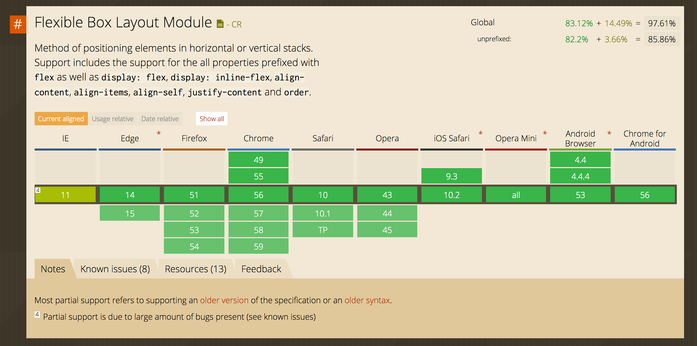
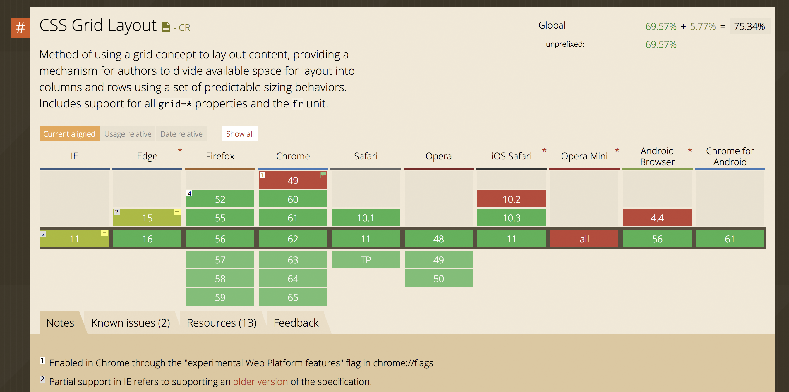

autoscale: true
build-lists: true

# CSS Grid Layout

---

# The web is fluid

[The first website](http://info.cern.ch/hypertext/WWW/TheProject.html)

---

# Layouts in the dark ages (the 90s)

- Complex nested tables
- inline styles (such as they were)
- spacer gifs

---

# Layouts in the dark ages (the 90s)

- absolutely no flexibility

---

# Table layouts

``` html
<TABLE BGCOLOR="#CCCCFF" BORDER=10 BORDERCOLOR="#0000FF" BORDERCOLORLIGHT="#33CCFF" BORDERCOLORDARK="#0000CC" WIDTH="80%" ALIGN="CENTER">
  <TR>
    <TD>
      <H1 align="center">
        <FONT SIZE="3" COLOR="red" FACE="verdana">
          Welcome to my home page!
        </FONT>
      </H1>
    </TD>
  </TR>
</TABLE>
```

---

# Table-less layouts – divs, floats and positioning

- separation of presentation and content
- floats
- absolute and relative positioning
- media queries

---


---

# Flexbox versus grid

- flexbox was designed for layout in one dimension, i.e. layout in a row *or* a column

^ share similar features

---

# Flexbox - `flex-direction: row`


---

# Flexbox - `flex-direction: column`


---

# Flexbox versus grid

- Grid was designed for two-dimensional layout, i.e. layout in rows and columns at the same time

---

# Grid


---

# Grid

CSS Grid Layout introduces a two dimensional grid system to CSS.

Grids can be used to lay out major page areas or small user interface elements.

---

## What is a grid?

A grid is an intersecting set of horizontal and vertical lines – one set defining columns and the other rows.

Elements can be placed onto the grid respecting these column and row lines.

---

## Features

- Fixed and flexible track sizes
- Item placement
- Creation of additional tracks to hold content
- Alignment control
- Control of overlapping content

^You can create a grid with fixed track sizes – using pixels for example. You can also create a grid using flexible sizes with percentages or with the new fr unit designed for this purpose.

^ You can place items into a precise location on the grid using line numbers, names or by targeting an area of the grid. Grid also contains an algorithm to control the placement of items not given an explicit position on the grid.

^ You can define an explicit grid with grid layout but the specification also deals with content added outside of a declared grid, adding additional rows and columns as needed. Features such as adding “as many columns as will fit into a container” are included.

^ Grid contains alignment features in order that we can control how items align once placed into a grid area, and how the entire grid is aligned.

^ More than one item can be placed into a grid cell, or areas can partially overlap each other. This layering may then be controlled with z-index.

---

## The Grid container

We create a grid container by declaring `display: grid` or `display: inline-grid` on an element.

As soon as we do this all direct children of that element will become grid items.

---

# Grid


^ It should be noted that when we define a grid we define the grid tracks, not the lines. Grid then gives us numbered lines to use when positioning items. In our three column, two row grid we have four column lines.

---

## `fr` unit

- Fractional unit
- `1fr` is for 1 part of the available space

---

# Use other CSS features

- `content-fill: fit-content` etc

---

# Browser support flexbox



---

# Browser support grid



---

# CSS `@supports`

- CSS feature queries

- `supports` allows us to check whether a browser has implemented a particular CSS feature

^
modernizr
^
Can only include code that is supported within @supports tag
^
No IE
^
Problem when @supports is supported but the feature you want to include isn't

